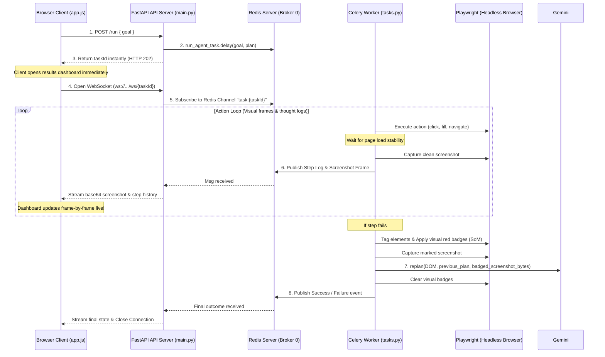

# Surfer — Autonomous AI Web Operator

Surfer is a full-stack, distributed web automation agent designed to execute complex tasks on the live internet. Powered by large language models (LLMs) and headless browser orchestration, Surfer turns high-level, natural language goals into precise, real-time web actions.

---

## 🌟 The Vision

The vision of Surfer is to build a **fully autonomous personal assistant** that works on your behalf. 

Instead of writing custom scripts for different websites, you provide a single high-level objective:
> *"Book a flight ticket from Delhi to Mumbai for next Tuesday under ₹6,000"* or *"Go to my dashboard, download the latest CSV invoice, and save a screenshot."*

Surfer takes this goal, plans the path, launches a browser, handles login screens, navigates forms, solves errors dynamically, and returns the finished state.

---

## 🚀 Key Features & Systems Architecture

Surfer is engineered for high performance, reliability, and horizontal scaling. It is built using a **decoupled asynchronous architecture**:



### 1. Asynchronous Distributed Task Queue (Celery + Redis)
* **Non-Blocking API**: The FastAPI backend offloads heavy browser operations to a background Celery worker queue instantly (responding in <5ms with a `task_id`).
* **Microservices Design**: The API server remains lightweight and responsive, while Celery workers execute resource-heavy Chromium processes independently.

### 2. Live WebSocket Frame & Log Streaming
* **Low Latency**: Uses WebSockets instead of HTTP polling, establishing a single persistent connection to push screenshots and logs instantly down to the browser.
* **Redis Pub/Sub Channel**: Connects Celery worker events to the FastAPI thread, enabling real-time frame buffering at native browser speeds.

### 3. Stable Selector Index Mapping
* **Dynamic Tagging**: Surfer injects a custom Javascript engine that scans the active page DOM and overlays temporary, sequential `data-surfer-id="[index]"` attributes on visible interactive elements.
* **100% Click Precision**: By forcing the LLM to target element indices (e.g. `click 3`) instead of volatile Tailwind hashes or raw CSS paths, Surfer bypasses class name changes and dynamic UI alterations.

### 4. Multimodal Visual Grounding (Set-of-Mark Vision)
* **Visual Overlays**: When a browser step fails, Surfer overlays red numbered badges directly on top of all interactive components.
* **multimodal replanning**: Passes the badged screenshot bytes directly to the Gemini Vision API alongside the textual DOM, allowing the model to physically "look" at the page layout to find recovery detours.

### 5. Optimistic Execution with Active Queue Replanning
* **Plan Remainder Routing**: When recovering from errors, Surfer passes the currently active queue of pending steps (`previous_plan`) rather than the stale initial plan. The model generates a brand-new plan from the current state all the way to the very end of the user goal.

### 6. Stealth & Anti-Bot Evasions
* **Automation Masking**: Spooofs standard navigator user-agents, viewport dimensions, timezone settings, and locale arguments to disable chromium automation signatures (hiding `--disable-blink-features=AutomationControlled` flags).

### 7. Automatic Multi-Tab Switching (Page Listener)
* **Popup Target Routing**: Listens to browser context page spawners. If clicking a product link forces a new tab to open (`target="_blank"`), the agent automatically shifts its active execution context (`self.page`) to the new tab.

### 8. Database-Driven Task Cancellation (Stop Button)
* **Platform-Independent Termination**: When the user clicks **Stop Agent**, FastAPI registers a `cancelled:{task_id}` flag in Redis. The Celery worker loops check this flag before executing any action, immediately aborting execution without requiring OS process kills.

### 9. Human Action Required Guardrail
* **Terminal Stop States**: Directs Gemini to generate a terminal `stop` step explaining the roadblock if the objective hits credit card processing, OTP requests, or multi-factor login checks.

### 10. Page Stability Settle Loops
* **Loading Spinner Evasion**: Automatically waits for `domcontentloaded` and `networkidle` states, along with a brief layout settling buffer, before capturing any screenshot or scraping the DOM. This prevents capturing blank pages or loading spinner assets.

### 11. Pydantic-Enforced Structured JSON Outputs
* **Deterministic Plans**: The planner uses `google-genai`'s structured decoding, enforcing strict Pydantic JSON schemas. This completely eliminates formatting bugs, markdown code blocks, or conversational preambles from the LLM.

### 12. Sleek Cockpit Dashboard UI Layout
* **Visual Grid Separations**: Restructured as an IDE dashboard where user controls and the scrollable live browser viewport occupy the top row, while diagnostics (scrolling terminal console and steps history) occupy the bottom row.

---

## 📂 Directory Structure

```
d:\Coding\Surfer\
├── backend/
│   ├── celery_app.py (Celery Broker Setup)
│   ├── tasks.py (Asynchronous Browser Worker)
│   ├── main.py (FastAPI App & Status Pollers)
│   ├── web_agent.py (Playwright Browser Driver)
│   ├── gemini.py (Pydantic LLM Planner)
│   └── .env (API Credentials)
└── frontend/
    ├── index.html (Dashboard Interface)
    ├── style.css (Glassmorphic Dark Theme)
    └── app.js (Real-time Status Polling Event Loop)
```

---

## 🛠️ Setup & Installation

### 1. Prerequisites
Ensure you have the following installed on your machine:
* Python 3.10+
* **[Redis Server](https://github.com/tporadowski/redis/releases)** (For Windows, download the latest `Redis-x64-5.0.14.1.zip` and extract it to `C:\Redis`).

### 2. Clone and Install Dependencies
Install the required packages in your Python environment:
```bash
pip install fastapi uvicorn "redis<5.0.0" celery google-genai python-dotenv playwright
python -m playwright install chromium
```
*(Note: We lock the client `redis` package below v5.0.0 to guarantee backward compatibility with Redis Server 5.x on Windows, bypassing RESP3 handshake issues).*

### 3. Add API Keys
Create a `.env` file inside the `backend/` directory:
```text
# backend/.env
GEMINI_API_KEY=your_google_gemini_api_key_here
```

---

## 🏃 Running the Application

To run the full decoupled system, open three terminal windows:

### Step 1: Start Redis Server
```powershell
cd C:\Redis-x64-5.0.14.1
./redis-server.exe
```

### Step 2: Start Celery Worker
Navigate to the `backend` directory and start the background worker:
```bash
cd backend
celery -A tasks worker --loglevel=info --pool=solo
```
*(Note: We use the `--pool=solo` flag on Windows to bypass the lack of Linux-native process forking).*

### Step 3: Start FastAPI Server
Navigate to the `backend` directory and run the API:
```bash
cd backend
python main.py
```

### Step 4: Open the Frontend
Open `frontend/index.html` directly in your browser. Enter your goal and click **Run Agent**!
